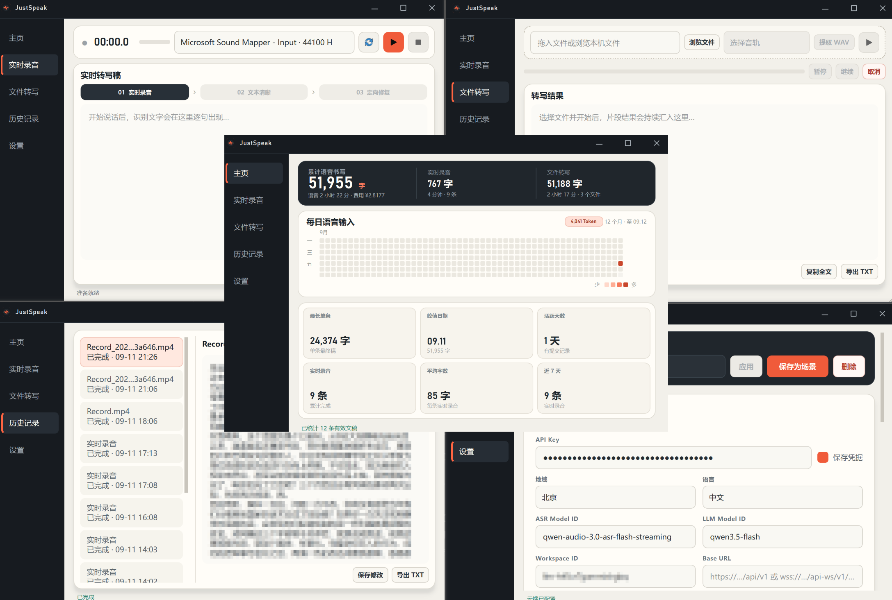

# JustSpeak Desktop



JustSpeak 是一款面向 Windows 的开源桌面语音转文字客户端。它将麦克风录音和音视频文件转换为文字，并可通过大语言模型继续完成文本清洗与定向修复。

音频采集、转码、任务数据库和历史文稿保存在本机；语音识别与可选的文本处理请求发送至用户自行配置的阿里云百炼账号。项目不下载本地语音模型，也不依赖 GPU、PyTorch 或 CUDA。

## 功能概览

- **使用统计**：累计展示实时录音、文件转写的字数与时长，以及活跃天数、峰值日期、Token 和按音频时长估算的费用。
- **实时录音**：边说边显示识别结果，支持暂停、继续和停止；继续录音时会创建新的云端流式连接。
- **屏幕信息增强**：可在开始实时录音前选择显示器，用 `qwen3.5-ocr` 提取完整屏幕文字并作为本次语音识别上下文。
- **文本处理流水线**：依次保留“屏幕上下文 → 实时录音 → 文本清洗 → 定向修复”四个阶段，可随时切换查看。
- **文件转写**：支持 FFmpeg 可解码的常见音频和视频格式，可选择音轨、单独提取 WAV、暂停任务和断点继续。
- **重叠切片**：文件按 1～10 分钟切片，相邻片段固定重叠 10 秒，降低切点附近丢字风险。
- **上下文增强**：可为文件转写设置术语、人名和产品名等定向转写 Prompt。
- **历史管理**：查看、编辑、复制、导出或删除文稿；默认保留最近 50 条，可调整为 10～600 条。
- **场景配置**：将地域、模型、语言和 Prompt 保存为场景，后续可直接应用。
- **快捷键**：实时录音页默认使用 `Space` 开始或暂停，使用 `S` 停止；支持改绑和停用。
- **本地凭据**：API Key 可仅在当前会话使用，也可保存到 Windows 凭据管理器。

历史记录清理不会回退主页累计统计。网络故障、应用退出或片段失败时，已经落盘的音频与已完成结果会继续保留。

## 系统要求

- Windows 10 或 Windows 11，64 位
- [Python 3.12](https://www.python.org/downloads/windows/)（使用源码运行时需要）
- FFmpeg 与 ffprobe，可使用 [gyan.dev Windows builds](https://www.gyan.dev/ffmpeg/builds/) 或 [BtbN Windows builds](https://github.com/BtbN/FFmpeg-Builds/releases)
- 已开通相应模型的阿里云百炼 API Key

便携版已经包含 Python 运行环境和 FFmpeg，无需另外安装这两项。

## 快速开始

### 使用便携版

从 GitHub Releases 下载便携 ZIP，完整解压后运行 `JustSpeak.exe`。请保留同目录的 `_internal` 文件夹。

未签名的自行构建版本首次运行时可能触发 Windows SmartScreen，可在确认文件来源后选择“更多信息 → 仍要运行”。

### 从源码运行

克隆仓库后，打开 `desktop` 目录并双击 `start.bat`。首次运行会自动调用 `setup.ps1`，创建 `.venv` 并安装依赖。

也可以从仓库根目录手动执行：

```powershell
cd .\desktop
powershell -ExecutionPolicy Bypass -File .\setup.ps1
.\start.bat
```

如果 FFmpeg 没有加入系统 `PATH`，请在设置页选择 `ffmpeg.exe`。程序会同时查找同目录下的 `ffprobe.exe`。

## 云端配置

打开“设置”，填写以下内容：

| 配置 | 说明 |
| --- | --- |
| API Key | 百炼密钥；勾选“保存凭据”后进入 Windows 凭据管理器 |
| 地域 | 北京或新加坡，需要与 API Key、Workspace 和模型所属地域一致 |
| ASR Model ID | 默认 `qwen-audio-3.0-asr-flash-streaming` |
| LLM Model ID | 可选；留空会跳过“文本清洗”和“定向修复” |
| 信息增强 | 可选；开始实时录音时对实时页选定的显示器执行一次 OCR |
| OCR Model ID | 默认 `qwen3.5-ocr` |
| OCR Base URL | 可选；支持业务空间专属的 OpenAI 兼容地址 |
| OCR 提取指令 | 控制屏幕文字提取方式，默认只输出图中文本 |
| Workspace ID | 使用业务空间专属模型时填写 |
| Base URL | 可选；留空时根据地域和 Workspace ID 自动生成 |
| 语言 | 中文、英文或自动识别 |

设置会自动保存，并只影响随后创建的新任务。进行中的任务以及历史任务继续使用启动时保存的配置快照。

实时识别使用 DashScope WebSocket API。LLM 文本处理使用同一域名下的 OpenAI 兼容 Chat Completions API。模型名称、地域和账号权限需要保持匹配，具体可参考：

- [百炼实时语音识别 Python SDK](https://help.aliyun.com/zh/model-studio/fun-asr-realtime-python-sdk)
- [百炼语音识别模型](https://help.aliyun.com/zh/model-studio/asr-model)
- [提升语音识别准确率](https://help.aliyun.com/zh/model-studio/improve-asr-accuracy)
- [百炼 OpenAI 兼容接口](https://help.aliyun.com/zh/model-studio/qwen-api-via-openai-chat-completions)
- [百炼 Qwen OCR 文字识别](https://help.aliyun.com/zh/model-studio/qwen-vl-ocr)

## 页面说明

### 主页

主页统计采用累加式台账，涵盖语音输入总字数、实时录音与文件转写时长、最长单条、峰值日期、活跃天数及最近七天使用情况。每日语音输入热力图可通过左下角“年 | 月”切换最近一年或最近 30 天。费用按音频时长 `0.00033 元/秒` 估算；仅在接口响应包含 Token 用量时展示 Token 统计。

### 实时录音

选择麦克风后开始录音。启用信息增强后，麦克风右侧会显示屏幕选择器，可按“屏幕 X：分辨率”选择要截取的显示器。应用会先截取选定显示器的完整画面，调用 OCR，将 HTML 等布局标记清洗为纯文本，再把文字追加到本次定向转写 Prompt。定向 Prompt 与屏幕文字合计最多 400 字符，用户手动填写的 Prompt 优先保留。OCR 失败时录音仍会继续，并在“屏幕上下文”阶段显示原因。

启用信息增强时，进入实时录音页会停留在“01 屏幕上下文”待机；开始录音后读取并回显 OCR 文字，完成后自动进入“02 实时录音”。暂停会结束当前云端连接并保留本次记录，再次开始时创建新连接；点击停止后依次进入“03 文本清洗”和“04 定向修复”。各阶段可用的文本会保存到同一条历史记录。实时页的所有阶段仅供查看；定向修复完成后，按空格会复制最终结果、清空当前界面并回到“01 屏幕上下文”，等待下一轮录音。

### 文件转写

拖入或选择音频、视频文件，确认音轨后开始转写。程序会统一转换为 16 kHz、单声道、16-bit PCM WAV，再按设置的时长进行重叠切片和顺序提交。原始媒体文件不会被修改。

### 历史记录

历史文稿支持查看处理阶段、编辑最终文本、复制全文、导出 UTF-8 TXT、继续未完成任务和删除。自动清理与手动删除只处理应用创建的任务目录。

### 设置

设置页管理云端模型链、双 Prompt、本地数据目录、FFmpeg、切片时长、历史保留数量、场景和快捷键。所有下拉框与数字框已禁用滚轮切换，降低页面滚动时误触的概率。

## 数据与隐私

默认数据目录为 `D:\ASR-Client\data`。目录不可用时，程序会回退到 `%LOCALAPPDATA%\JustSpeak\data`。

```text
data/
├─ justspeak.sqlite3
└─ tasks/<session-id>/
   ├─ audio.wav / recording.pcm / recording.wav
   ├─ chunks/ 或 gaps/
   ├─ responses/
   ├─ stages/
   ├─ manifest.json
   └─ transcript.txt
```

- API Key 不写入仓库、SQLite、普通配置文件或日志。
- 勾选保存凭据后，密钥由 Windows 凭据管理器保存，服务名为 `JustSpeak-ASR`。
- 日志位于 `%LOCALAPPDATA%\JustSpeak\logs`，不会记录完整请求头或音频 Base64。
- 信息增强截图只在内存中缩放与编码，发送到用户配置的 OCR 接口后即释放，不写入本地图片文件。OCR 文字会进入本次任务的配置快照和阶段记录，便于网络缺口补转写及历史查看时继续使用。
- 音频只发送到用户配置的云端服务，本项目没有自建中转服务器。

## 开发

项目采用 Python 3.12、PySide6、DashScope SDK、sounddevice、NumPy、SQLite 和 keyring。

```text
src/asr_client/
├─ ui/          # 五个页面、主题和窗口组件
├─ audio/       # 录音重采样、FFmpeg 与重叠切片
├─ providers/   # DashScope ASR 与 LLM 适配
├─ jobs/        # 实时录音、文件任务和恢复流程
└─ storage/     # 配置、凭据与 SQLite
```

运行测试：

```powershell
.\.venv\Scripts\python.exe -m pytest
.\.venv\Scripts\python.exe -m compileall -q src tests scripts
```

当前自动化测试覆盖配置迁移、音频切片、流式重采样、任务恢复、历史保留、累计统计、文本处理超时、快捷键和冻结应用内置 FFmpeg 查找。

模拟长任务：

```powershell
.\.venv\Scripts\python.exe scripts\simulate_long_run.py --minutes 60
.\.venv\Scripts\python.exe scripts\simulate_long_file.py --minutes 60
```

## 构建 Windows 便携版

```powershell
.\build_exe.ps1
```

脚本会从当前设置、项目 `bin` 或系统 `PATH` 查找 FFmpeg。也可以显式指定目录：

```powershell
.\build_exe.ps1 -FFmpegDir "D:\path\to\ffmpeg\bin"
```

输出位于 `dist\JustSpeak\JustSpeak.exe`。发布时需要打包整个 `dist\JustSpeak` 文件夹。构建脚本会同时复制 FFmpeg 自带的许可证文件。

## 已知限制

- 当前仅支持 Windows 和阿里云百炼。
- 不支持系统声音采集、说话人分离、翻译、SRT 字幕编辑和全局输入法注入。
- 文件暂停会在当前片段处理完成后生效。
- 云端速度、识别准确率、模型可用性与费用由用户账号、地域、模型和网络决定。
- 远端超时后重试可能产生额外调用费用，应用会保存请求 ID 与尝试次数用于排查。

## 许可证

项目源码采用 [MIT License](../LICENSE)。第三方组件及 FFmpeg 分发说明见 [THIRD_PARTY_NOTICES.md](./THIRD_PARTY_NOTICES.md)。
